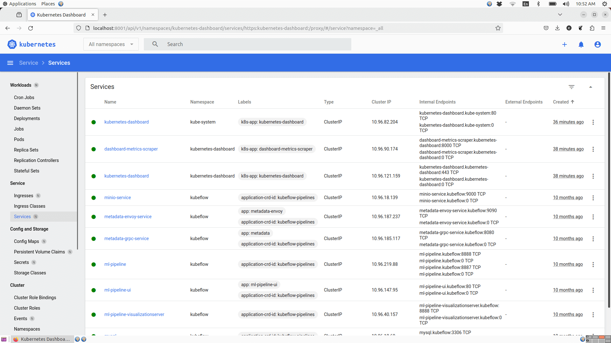

### The Kubernetes Dashboard is a web UI for Kubernetes clusters. 

**It allows you to:**

* View and manage cluster resources (namespaces, deployments, pods, services, etc.).

* Monitor workload health and logs.

* Perform some cluster operations (e.g., scaling, deleting) via the UI.

* Access features like RBAC-based login, metrics, etc.

* A typical YAML file to deploy it might:

* Create a Namespace (e.g., kubernetes-dashboard).

* Deploy the dashboard’s Deployment (container image, ports, replicas).

* Expose a Service (ClusterIP or NodePort) for the dashboard.

 This folder contains two files, **kubernetes-dashboard.yml** file, which contains config or manifest for all the resources which need to setup dashboard and **dashboard_setup.sh** file is bash script, which contains all the instructions to setup the dashboard.

### In master node

#### Use any one of the bellow method

1. We can just download these two files and run the bash script with the bellow command
  
  **bash dashboard_setup.sh install**   
  Here **install** is an argument, which is used inside the script.

2. Without downloading the file just run the bellow command

  **curl -s https://raw.githubusercontent.com/AbhiGowdaIndia/kubernetes/main/Kubernetes_Dashboard/kubernete-dashboard.yml | bash -s install**

  Please copy the **tocken** displayed after installation (Displayed on screen).

* After installation done with anyone of the above methods, open the dashboard with **public ip of Master node** with **https** (not with http).   
**Example:** If your Masternode public ip is **43.205.206.39** then in browser you should use **https://43.205.206.39:32000**

* Here it will ask for **tocken** and paste the tocken that we copied. Now we can see the dashboard.

### Following are some screenshots of the kubernetes dashboard

### Dashboard Overview

### Pods View

### Jobs View
